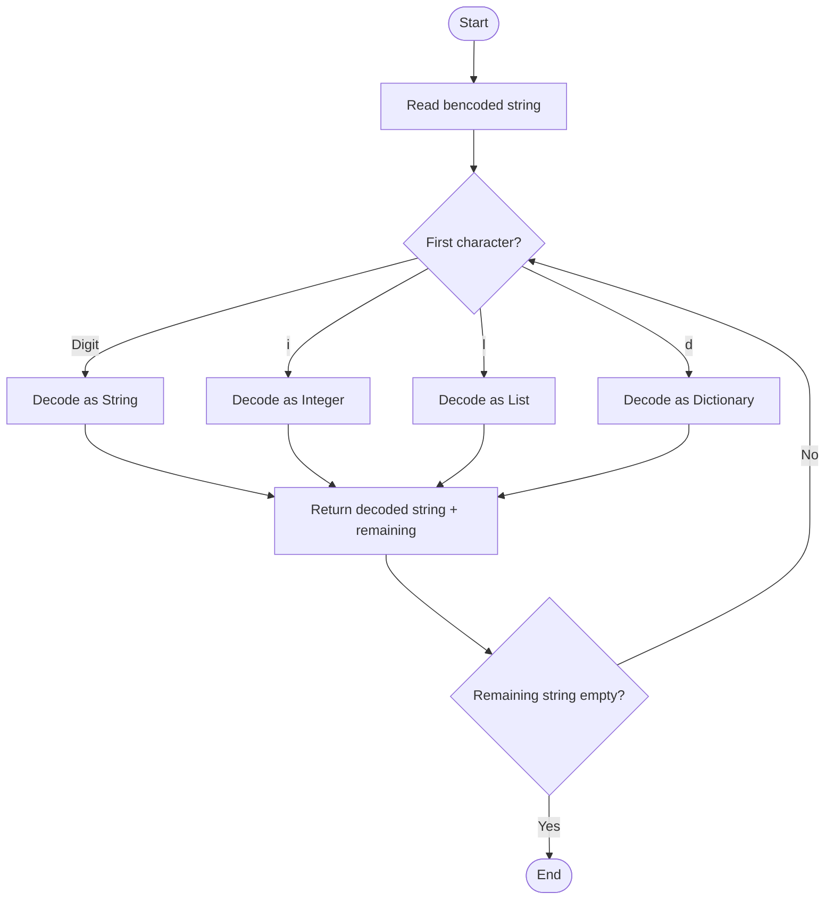

# Bencoding Decoder in Go

This project is a **Bencoding decoder** implemented in Go.  
It can decode **strings, integers, lists, and dictionaries** encoded using the [Bencoding format](https://en.wikipedia.org/wiki/Bencode), which is commonly used in **BitTorrent**.

---

## 📜 What is Bencoding?

Bencoding is a simple encoding format used by the BitTorrent protocol to store and transmit data.  
It supports **four data types**:

1. **Strings**  
   Format: `<length>:<string>`  
   Example:  
   ```
   4:spam  →  "spam"
   ```

2. **Integers**  
   Format: `i<integer>e`  
   Example:  
   ```
   i42e  →  42
   ```

3. **Lists**  
   Format: `l<item1><item2>...e`  
   Example:  
   ```
   l4:spam4:eggse  →  ["spam", "eggs"]
   ```

4. **Dictionaries**  
   Format: `d<key><value>...e`  
   Example:  
   ```
   d3:cow3:moo4:spam4:eggse  
   →  { "cow": "moo", "spam": "eggs" }
   ```

---

## 📂 Project Structure

```
myproject/
├── go.mod
├── main.go          # Entry point - takes user input and decodes it
└── bencoding/
    └── bencoding.go # Bencoding decoding logic
```

---

## How to Run Locally

### 1️⃣ Clone the repository
```bash
git clone https://github.com/omjogani/bencoding-decoding.git
cd bencoding-decoder-go
```

### 2️⃣ Initialize Go module
```bash
go mod init github.com/omjogani
```

### 3️⃣ Run the program
```bash
go run main.go
```

---

## 💻 Example Usage

```
Enter a bencoded string: 4:spam
Decoded value: spam
Remaining string:

Enter a bencoded string: i42e
Decoded value: 42
Remaining string:

Enter a bencoded string: l4:spam4:eggse
Decoded value: [spam eggs]
Remaining string:

Enter a bencoded string: d3:cow3:moo4:spam4:eggse
Decoded value: map[cow:moo spam:eggs]
Remaining string:
```

---

## 🛠 How It Works

- **`main.go`**  
  - Reads user input from the terminal  
  - Passes it to `bencoding.DecodeBencode()`  
  - Prints the decoded value and any remaining string

- **`bencoding/bencoding.go`**  
  - Implements decoding functions for:
    - Strings (`decodeBencodedString`)
    - Integers (`decodeBencodedInteger`)
    - Lists (`decodeBencodedList`)
    - Dictionaries (`decodeBencodedDictionary`)
  - Uses recursion to handle nested structures

---

## 📊 Bencoding Decoding Flow



---

## 📌 Example of Nested Decoding

Input:
```
d4:spaml4:spam4:eggsei42ee
```

Output:
```
Decoded value: map[spam:[spam eggs] 42]
Remaining string:
```
